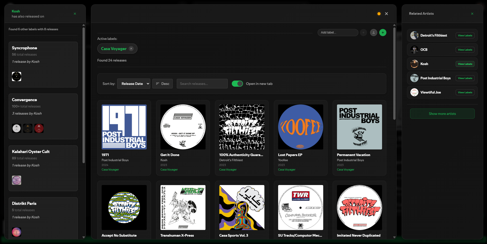
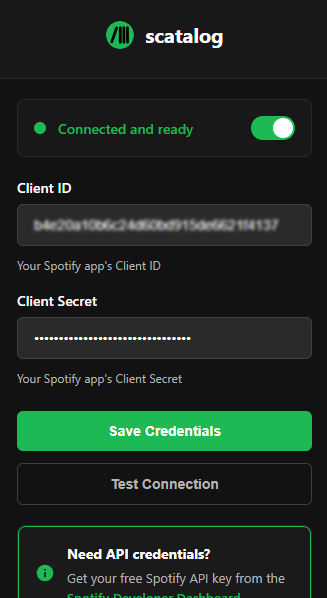
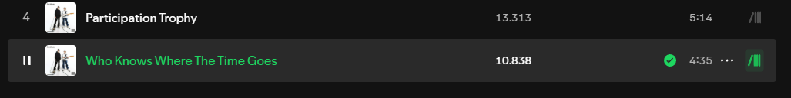
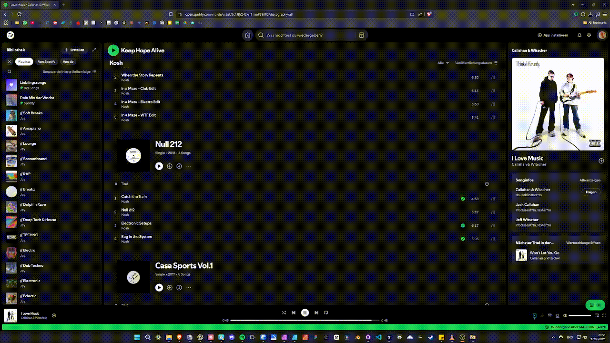

# scatalog 
### v.0.1.2

## Explore Label Archives on Spotify — Browser Extension

###  Features

**Complete Label Catalogs** — *Browse every release from any record label right in Spotify.*

**Artist & Label Discovery** — *See related artists and uncover all the other labels they’re on.*

**Search & Sorting** — *Filter, sort, and search through catalogs.*

_________________________________________________

##  Quick Start Guide

### 1. Install the Extension
1. Download and extract this repository zip (Code → Download ZIP)
4. Open Extension Manager of your Browser 
**(go to `chrome://extensions/` or `brave://extensions/`)**
4. Enable "Developer mode" (toggle in top)
5. Click "Load unpacked" and select the extracted folder `scatalog-main`

### 2. Get Spotify API Credentials
1. Go to [Spotify Developer Dashboard](https://developer.spotify.com/dashboard) and Log in
2. Go to Dashboard via the Profile Button in the top right
3. Click "Create App" and fill in any app name and description
4. Copy your **Client ID** and **Client Secret**

### 3. Connect to API
1. Click the scatalog extension icon in the toolbar of your browser
2. Paste your **Client ID** and **Client Secret** and "Save Credentials"

### 4. Start Exploring
1. Go to [open.spotify.com](https://open.spotify.com)
2. Click the scatalog button next to the track time

3. Explore that record label's entire catalog

_________________________________________________

## Browse complete label catalogs & discover new artists through label connections  

Music discovery should be about exploration and connection, not strategic corporate limitations. 

**Related Artists** recommendations prioritizes artists appearing on one or across multiple labels, taking release number and frequency into account.

**Independent labels are the driving force** behind genre innovation and musical diversity. Who operates outside the mainstream spotlight of curated playlists, algorithmic recommendations and major label contracts deserves to be found. Labels deserver their own spotify page.  

_________________________________________________

### Requirements

 ✅ Supported Browsers
 - **Brave Browser** 1.20+ (Recommended)
- **Chrome** 88+ 
- **Microsoft Edge** 88+ 
- **Opera** 74+ 
- **Vivaldi** 4.0+

❌ Unsupported Browsers
- **Firefox**
- **Safari** 
- **Internet Explorer** 

